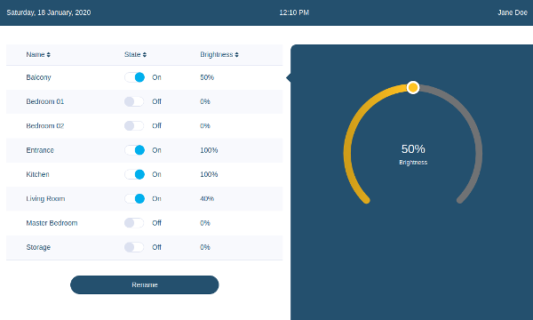
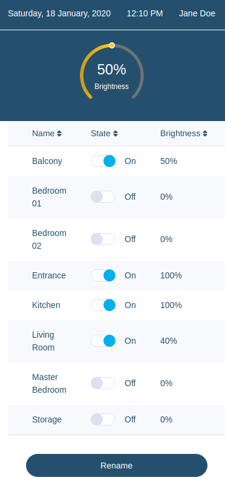

# Home automation dashboard

## Screenshots

### Desktop

### Mobile

## Usage

Start the server with `node light-api/index.js`.

Run the app with `npm start`

## Notes

### Restore Brightness to Original Value

When switching off a bulb, its brightness should be restored to its original value when it is turned on again.

For this feature the function `setDisplayBrightness` is used.

It has been tested with jest (/components/tests/app.test.js)

### Renaming Bulbs

The feature to rename bulbs should not be part of the main screen, since it is assumed the main screen is used to switch on/off lights and change brightness; renaming bulbs is much less common and the feature should be tucked away in a menu.

But in any case, I opted for the neatest of solutions I could think of, a Rename button. This is not even a form, just a dynamically updated field.

### Writing Data to the Server

At what stage should this be done? My first implementation involved having the updated data (new name, on/off switch, or brightness) sent to the server, reading back the data from the server and updating state, which would update the interface. This resulted in the app being slow: moving the brightness selector seemed to be lagging a response.

Then I opted to store the current state in a const named `backupBulbs`, updating the state and hence the interface immediately so that the user gets a very quick response to changes, sending the data to the server, and if, for some reason, that fails, the state would be restored to the previous settings stored in `backupBulbs`, and a message can be prompted to the user.

### 'Mobile First' Development

This project was built with a 'mobile first' mentality as can be attested from the CSS media querying.

## Improvements

A menu to hide away the renaming feature.

A button to switch all bulbs off and restore them to original brightness.

An option to set the whole lighting system to customized settings, such as a 'night-mode', or 'I am out of the house' mode. Some people love to keep some lights on at night or when they go out.

A 'burglar-scare-off' feature. When on holiday, certain bulbs can be switched on/off in a 'controlled-random' way so that the residence does not always have dark rooms, thus signalling to burglars that there is no one home. Imagine a villa visible from a distance with all lights switched off. Imagine then some lights being turned on/off at random to make belief that there is someone inside.

Positive Stops: around the diameter of the ArcSlider I would make notches, that act like buttons, at 0%, 25%, 50%, 75% and 100% which the user can press to set the brightness to those levels. I am assuming some users would love this.

